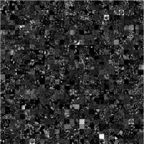

# Awesome Texture Datasets - Curated List of Texture Datasets

## Introduction

This document targets people interested in (pre-)training deep neural networks for texture-related tasks

## Texture Definition

A texture is a repeating pattern. Patterns can occur in regular, near-regular, irregular, near-stochastic, and stochastic forms. For reference, see visualized examples in the case of 2D color images (see Fig. 1)

Figure 1: Texture types

## Relevance

Textures appear in a wide variety of settings, find a list of non-exhaustive settings below

- Drone observations &amp; Satellite imagery
- Microscopic and Macroscopic observations
  - Medical sciences, e.g. particles, cells, tissue, fluids, …
  - Textile, copper, and steel, … industries
- Visual Conveyer belt analysis
- Detection of cracks, voids, and unknown anomalies

## Outline

The document is structured by task, currently including

- Texture Classification
- Anomaly / Defect detection in Textures
- Texture (instance) segmentation

Each section contains a list of datasets described by example image(s), abbreviation, optional full name and comment, number of samples, and link.

# Texture Classification

## CytoImageNet

Large Scale Pretraining for microscopy data

890 000 images, 894 classes

[https://paperswithcode.com/dataset/cytoimagenet](https://paperswithcode.com/dataset/cytoimagenet)

## DTD - Describable Textures Dataset

5640 images, 47 classes

[https://www.robots.ox.ac.uk/~vgg/data/dtd/](https://www.robots.ox.ac.uk/~vgg/data/dtd/)

## The Textures Dataset

8400 images, 64 classes

[https://github.com/abin24/Textures-Dataset](https://github.com/abin24/Textures-Dataset)

## TEM nanowire morphologies

400 images, 4 Classes

[https://paperswithcode.com/dataset/tem-nanowire-morphologies-for-classification](https://paperswithcode.com/dataset/tem-nanowire-morphologies-for-classification)

## TIILDA - Textile Textures Database

3200 images, 8 Classes (7 Defect classes, 1 Good Class)

[https://lmb.informatik.uni-freiburg.de/resources/datasets/tilda.en.html](https://lmb.informatik.uni-freiburg.de/resources/datasets/tilda.en.html)

## ALOT - Amsterdam Library of Textures

27000 images, 250 Classes (Materials)

[https://aloi.science.uva.nl/public\_alot/](https://aloi.science.uva.nl/public_alot/)

# Defect Detection

## DAGM Defect detection

Artificial Stochastic Textures

4000 generated images with weak labels

[https://conferences.mpi-inf.mpg.de/dagm/2007/prizes.html](https://conferences.mpi-inf.mpg.de/dagm/2007/prizes.html)

## Severstal Steel

Defect detection kaggle challenge

10 000 images Fine annotations + Box annotations

[https://www.kaggle.com/competitions/severstal-steel-defect-detection/overview](https://www.kaggle.com/competitions/severstal-steel-defect-detection/overview)

[https://medium.com/@bhargavchowdaryk26/severstal-steel-defect-detection-23201d43fa7b](https://medium.com/@bhargavchowdaryk26/severstal-steel-defect-detection-23201d43fa7b)

## KOLEKTOR SSD / KOLEKTOR SSD 2

Fine annotations + Box annotations

[https://paperswithcode.com/dataset/kolektorsdd](https://paperswithcode.com/dataset/kolektorsdd)

399 images

[https://paperswithcode.com/dataset/kolektorsdd2](https://paperswithcode.com/dataset/kolektorsdd2)

3000 images

## MVTEC

Parts of the MVTEC Dataset

~ 1000 Bilder in 5 classes with anomalies

[https://link.springer.com/article/10.1007/s11263-020-01400-4](https://link.springer.com/article/10.1007/s11263-020-01400-4)

## Surface Crack Detection

Kaggle challenge for civil engineering

40 000 images

[https://www.kaggle.com/datasets/arunrk7/surface-crack-detection](https://www.kaggle.com/datasets/arunrk7/surface-crack-detection)

# Texture Segmentation &amp; Instance Segmentation

## PASTIS

Panoptic segmentation of satellite time series

~2400 Bilder

[https://paperswithcode.com/dataset/pastis](https://paperswithcode.com/dataset/pastis)

## SkyScapes

70 000 images / very fine annotations

[https://eoc-dataset.dlr.de/](https://eoc-dataset.dlr.de/)

More satellite datasets:

[https://github.com/chrieke/awesome-satellite-imagery-datasets](https://github.com/chrieke/awesome-satellite-imagery-datasets)

# Discussion and Conclusion

The most significant contributors to texture-based datasets come from bioinformatics, steel industries, textile industries, civil engineering, and satellite observation.

Currently, texture datasets for microelectronic manufacturing, battery manufacturing, and nanotechnology, in general, are missing. Further, open source datasets for instance segmentation in granular textures like rocks, grains, or particles are missing.

## Conclusion

We collected 12 datasets from a total of 3 use cases: Texture classification (6), defect detection (4), and (instance) segmentation (2).

The sources of the datasets are microscopy (4), macroscopy (5), artificial (1), and satellite imagery (2, more available)

## Outlook

Currently, only one texture dataset is of artificial nature, and it was created with a fairly simple image processing algorithm in 2001. Generating artificial texture data needs more focus. A good texture generator that includes variables for granularity, randomness, and probably some deep features derived from existing datasets could provide an infinite source of textures. Research in the field of style transfer and inpainting has shown that models today are capable of learning abstract texture information [citation missing]. Yet, currently (JUL 22) it is hard to find any generated texture datasets. Generated textures could fill the gap in currently missing open source datasets.
